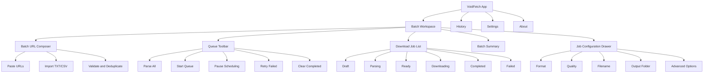
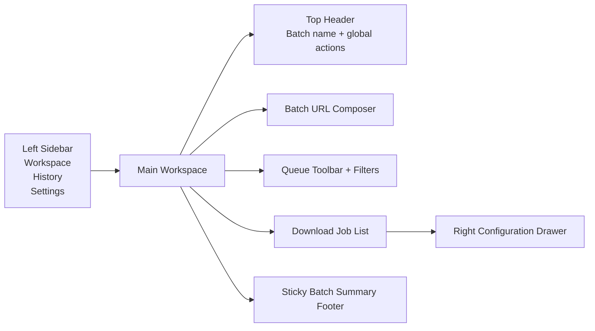
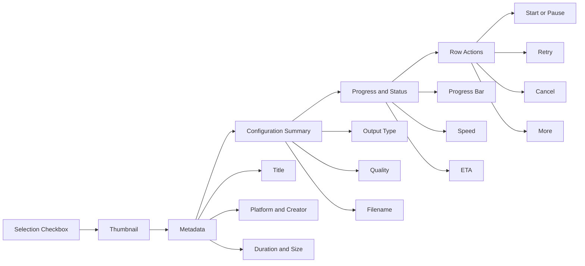
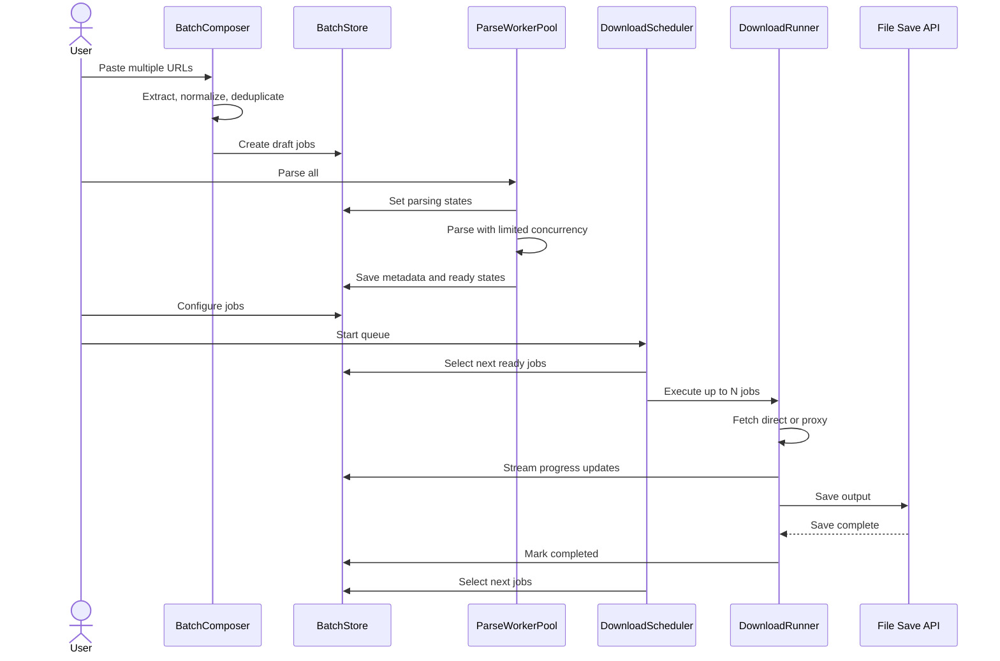
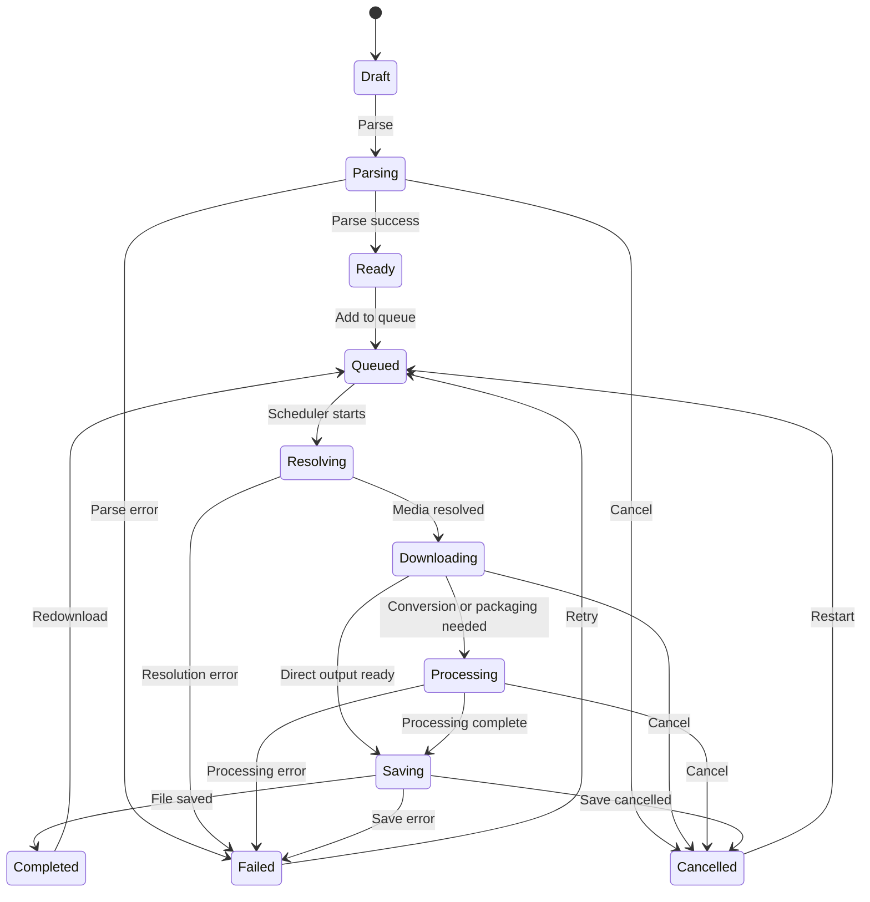

# VoidFetch — Batch Media Downloader Requirements

> Product owner: VoidStation  
> Proposed application name: **VoidFetch**  
> Document type: Product Requirements + Technical Architecture + UI/UX Specification  
> Target baseline: fork/refactor of `lxw15337674/galaxy-downloader`

---

## 1. Product Summary

**VoidFetch** is a batch media download workspace for collecting, configuring, queuing, and downloading media from multiple supported URLs.

The new product should retain the existing platform parsing and media-download capabilities while replacing the current single-URL workflow with a queue-oriented experience suitable for:

- Pasting many URLs at once.
- Parsing several URLs concurrently.
- Reviewing every detected media item before download.
- Configuring format and output options per item.
- Running multiple downloads with a controlled concurrency limit.
- Pausing, resuming, retrying, cancelling, reordering, and removing jobs.
- Viewing live progress, speed, ETA, status, and errors for every item.
- Persisting unfinished jobs and download history locally.
- Presenting VoidStation branding and copyright throughout the application.

---

## 2. Recommended App Name

### Primary recommendation

# **VoidFetch**

Reasoning:

- Short and memorable.
- Connects naturally to the VoidStation workspace.
- Does not limit the product to one platform or media type.
- Works for both browser and desktop editions.
- Supports future extensions such as playlists, channel imports, audio extraction, and scheduled jobs.

Suggested naming:

- Product name: `VoidFetch`
- Repository name: `voidfetch`
- Package name: `voidfetch-app`
- Desktop executable: `VoidFetch`
- Browser title: `VoidFetch — Batch Media Downloader`
- Internal namespace: `voidstation.voidfetch`

Alternative names:

1. VoidQueue
2. VoidGrab
3. NebulaFetch
4. OrbitBatch
5. VoidStation Downloader

---

## 3. Existing Repository Assessment

### 3.1 Current technology stack

The current repository is a web application based on:

- vinext
- Next.js App Router-compatible architecture
- React 19
- TypeScript
- Vite
- Tailwind CSS
- shadcn/ui
- Browser Fetch API
- FFmpeg.wasm
- JSZip
- Cloudflare Workers deployment support

The current product already supports many social and media platforms and already includes:

- Automatic platform detection.
- Unified URL parsing.
- Local download history.
- Browser-side HLS processing.
- Browser-side audio extraction.
- Multi-image packaging.
- Retry handling.
- AbortController-based cancellation.
- Direct-download fallback through a proxy.

### 3.2 Current state model

The current main downloader is designed around a single active input and a single active parse result:

```ts
const [url, setUrl] = useState("");
const [loading, setLoading] = useState(false);
const [parseResult, setParseResult] = useState<
  UnifiedParseResult["data"] | null
>(null);
```

This architecture is suitable for one URL at a time but is not sufficient for a batch workspace.

The new implementation must replace the single-result state with a normalized job collection and a queue scheduler.

### 3.3 Can the current repo download concurrently?

## Yes, partially.

The existing HLS implementation already downloads multiple HLS segments in parallel.

Current constants include:

```ts
const DOWNLOAD_CONCURRENCY = 8;
const SEGMENT_DOWNLOAD_RETRIES = 3;
const HOST_PROBE_CONCURRENCY = 2;
```

It also includes a reusable worker-pool pattern:

```ts
async function runWithConcurrency<T>(
  items: T[],
  concurrency: number,
  worker: (item: T, index: number) => Promise<void>,
): Promise<void>;
```

The HLS downloader launches multiple workers using `Promise.all`, while preserving output order before writing chunks to the final stream.

Therefore:

- Segment-level parallelism: **already implemented**
- Per-download retry: **already implemented**
- Per-download cancellation: **already implemented**
- Multi-URL job queue: **not implemented**
- Global concurrency control across multiple videos: **not implemented**
- Pause and resume for normal downloads: **not implemented**
- Durable queued-job recovery: **not implemented**

### 3.4 Important concurrency distinction

The redesigned system needs two separate concurrency layers:

1. **Job concurrency**
   - Number of videos downloading simultaneously.
   - Recommended default: `3`
   - User-configurable range: `1–6`

2. **Segment concurrency**
   - Number of HLS chunks fetched simultaneously inside one video job.
   - Existing default: `8`
   - Recommended adaptive range: `2–12`

Example:

```text
3 active video jobs × 8 HLS workers = up to 24 active segment requests
```

This may be too aggressive on mobile devices or limited networks. The scheduler must apply a global request budget.

Recommended initial policy:

```ts
MAX_ACTIVE_JOBS = 3;
DEFAULT_SEGMENT_CONCURRENCY = 6;
GLOBAL_NETWORK_BUDGET = 18;
```

The scheduler may reduce segment concurrency dynamically:

```ts
effectiveSegmentConcurrency = Math.max(
  2,
  Math.floor(GLOBAL_NETWORK_BUDGET / activeJobCount),
);
```

---

## 4. Legal and Repository Licensing Requirement

No root `LICENSE` file was found during the repository review.

This means the source code must **not** automatically be assumed to be freely reusable, redistributable, or relicensable.

Before publishing a fork or derivative repository, VoidStation should complete one of these actions:

1. Obtain explicit permission from the original repository owner.
2. Confirm a license from another authoritative repository location.
3. Reimplement the necessary behavior without copying protected source code.
4. Keep the derivative private until permission or license status is resolved.

This document is a technical requirements specification and is not legal advice.

---

## 5. VoidStation Copyright Requirements

### 5.1 Application footer

Display:

```text
© 2026 VoidStation. All rights reserved.
```

Recommended extended version:

```text
VoidFetch © 2026 VoidStation. All rights reserved.
Media rights remain with their respective owners.
```

### 5.2 About dialog

The About screen must include:

- Product: VoidFetch
- Publisher: VoidStation
- Version number
- Build commit
- Runtime/platform
- Open-source acknowledgements
- Third-party licenses
- Privacy statement
- Responsible-use notice

### 5.3 Source headers for newly authored files

Use this only for files created by VoidStation, not to overwrite third-party authorship:

```ts
/**
 * VoidFetch
 * Copyright (c) 2026 VoidStation.
 * All rights reserved.
 */
```

### 5.4 Package metadata

Recommended:

```json
{
  "name": "voidfetch",
  "productName": "VoidFetch",
  "author": "VoidStation",
  "license": "UNLICENSED",
  "private": true
}
```

Keep the repository private while the upstream license status is unresolved.

---

## 6. Product Goals

### Primary goals

- Enable users to add and process many media URLs efficiently.
- Make each download job independently configurable.
- Provide clear queue state and transparent progress.
- Avoid browser freezes and unbounded network requests.
- Preserve completed and pending jobs across reloads.
- Maintain platform compatibility from the existing parser.
- Modernize the interface around a professional desktop-workspace pattern.

### Non-goals for the first release

- Cloud account synchronization.
- Server-side media storage.
- Automated DRM bypass.
- Login-cookie extraction from third-party browsers.
- Scheduled scraping.
- Platform-account automation.
- Unlimited concurrency.
- Circumvention of access controls.

---

## 7. Core User Stories

### Batch input

- As a user, I can paste multiple URLs separated by lines.
- As a user, I can import URLs from a `.txt` or `.csv` file.
- As a user, I can remove duplicates before parsing.
- As a user, I can see invalid and unsupported URLs immediately.
- As a user, I can add more URLs while existing jobs are running.

### Parsing

- As a user, I can parse all queued URLs.
- As a user, I can configure parsing concurrency.
- As a user, I can retry only failed parse jobs.
- As a user, I can inspect the source platform and media metadata.

### Per-video configuration

- As a user, I can select video, audio, or image output.
- As a user, I can select quality or stream variant.
- As a user, I can edit the output filename.
- As a user, I can select an output folder when supported.
- As a user, I can apply settings to one item or all selected items.
- As a user, I can exclude an item without deleting it.

### Queue operations

- As a user, I can start all ready jobs.
- As a user, I can pause queue scheduling.
- As a user, I can cancel an active job.
- As a user, I can retry failed jobs.
- As a user, I can reorder pending jobs.
- As a user, I can clear completed jobs.
- As a user, I can filter jobs by status or platform.

### Monitoring

- As a user, I can see item progress.
- As a user, I can see total batch progress.
- As a user, I can see download speed and ETA.
- As a user, I can open detailed logs for failed jobs.
- As a user, I can copy a source URL or error message.

---

## 8. Functional Requirements

## 8.1 Batch URL input

The batch composer must support:

- Multiline paste.
- One URL per line.
- URLs embedded in arbitrary copied text.
- Automatic URL extraction.
- Duplicate removal.
- Maximum initial batch size: 200 URLs.
- Configurable warning threshold: 50 URLs.
- `.txt` import.
- `.csv` import using a selectable URL column.
- Drag-and-drop file import.
- Paste-from-clipboard action.
- Clear-all action.

Validation states:

```ts
type InputValidationStatus =
  | "valid"
  | "duplicate"
  | "unsupported"
  | "malformed"
  | "empty";
```

### Acceptance criteria

- Duplicate URLs are detected after normalization.
- Tracking parameters may optionally be removed.
- The UI reports accepted, duplicate, invalid, and unsupported counts.
- Invalid rows do not block valid rows from being added.

---

## 8.2 Parse queue

Introduce a parse queue separate from the download queue.

Recommended parse concurrency:

```ts
DEFAULT_PARSE_CONCURRENCY = 4;
MAX_PARSE_CONCURRENCY = 8;
```

Each parse job must support:

- Pending
- Parsing
- Parsed
- Parse failed
- Cancelled

The queue must respect rate-limit responses and apply exponential backoff.

---

## 8.3 Download queue

Each parsed media item becomes a `DownloadJob`.

```ts
type DownloadJobStatus =
  | "draft"
  | "ready"
  | "queued"
  | "resolving"
  | "downloading"
  | "processing"
  | "saving"
  | "paused"
  | "completed"
  | "failed"
  | "cancelled";
```

Scheduler requirements:

- Configurable max active jobs.
- FIFO default ordering.
- Manual priority override.
- Per-job AbortController.
- Automatic retry for transient failures.
- No retry for validation or unsupported-format errors.
- Optional continue-on-error behavior.
- Queue pause prevents new jobs from starting.
- Active jobs may finish while queue scheduling is paused.
- Cancelling one job must not cancel other jobs.
- Browser tab unload warning while jobs are active.

---

## 8.4 Per-video configuration

Each row must allow configuration of:

### Output type

- Original video
- MP4 video
- Audio only
- Original images
- ZIP images
- Platform-dependent media parts

### Quality

- Best available
- Original
- 2160p
- 1440p
- 1080p
- 720p
- 480p
- Audio bitrate options where supported

### Naming

Template examples:

```text
{index} - {title}
{platform}_{creator}_{id}
{date}_{title}_{quality}
```

Available variables:

- `{index}`
- `{title}`
- `{creator}`
- `{platform}`
- `{mediaId}`
- `{quality}`
- `{date}`
- `{timestamp}`

### Folder

Browser edition:

- Use File System Access API when available.
- Fall back to browser download prompts.
- Clearly show browser limitations.

Desktop edition:

- Persistent output directory.
- Per-job output override.
- Open-folder action.
- Reveal-file action.

### Advanced options

- Download thumbnail.
- Save metadata JSON.
- Extract audio.
- Include captions when supported.
- Include all carousel images.
- Package images as ZIP.
- Prefer original media URL.
- Use proxy fallback.
- Retry count.
- Per-job segment concurrency override.

---

## 9. Proposed Data Model

```ts
interface BatchProject {
  id: string;
  name: string;
  createdAt: number;
  updatedAt: number;
  settings: BatchSettings;
  jobIds: string[];
}

interface BatchSettings {
  parseConcurrency: number;
  downloadConcurrency: number;
  globalNetworkBudget: number;
  defaultOutputType: OutputType;
  defaultQuality: string;
  filenameTemplate: string;
  outputDirectoryHandleId?: string;
  continueOnError: boolean;
  autoStartDownloads: boolean;
}

interface DownloadJob {
  id: string;
  sourceUrl: string;
  normalizedUrl: string;
  platform?: string;

  status: DownloadJobStatus;
  priority: number;
  createdAt: number;
  updatedAt: number;
  startedAt?: number;
  completedAt?: number;

  metadata?: MediaMetadata;
  config: DownloadConfig;
  progress: DownloadProgress;
  error?: DownloadError;

  retryCount: number;
  maxRetries: number;
}

interface DownloadConfig {
  enabled: boolean;
  outputType: OutputType;
  quality: string;
  filename: string;
  outputDirectory?: string;
  downloadThumbnail: boolean;
  saveMetadata: boolean;
  extractAudio: boolean;
  packageImagesAsZip: boolean;
  segmentConcurrency?: number;
}

interface DownloadProgress {
  percent: number;
  downloadedBytes: number;
  totalBytes?: number;
  speedBytesPerSecond?: number;
  etaSeconds?: number;
  completedUnits?: number;
  totalUnits?: number;
}

interface DownloadError {
  code: string;
  message: string;
  retryable: boolean;
  httpStatus?: number;
  requestId?: string;
  details?: unknown;
}
```

---

## 10. State Management Architecture

The current component-local state should not be expanded into a very large `useState` collection.

Recommended approach:

- `useReducer` for MVP, or
- Zustand for a scalable client-side queue store.

Suggested modules:

```text
src/features/batch-download/
├── components/
│   ├── BatchComposer.tsx
│   ├── BatchToolbar.tsx
│   ├── DownloadQueue.tsx
│   ├── DownloadJobRow.tsx
│   ├── JobConfigDrawer.tsx
│   ├── BatchProgressBar.tsx
│   ├── QueueFilters.tsx
│   └── JobErrorDialog.tsx
├── hooks/
│   ├── useBatchImport.ts
│   ├── useQueueScheduler.ts
│   ├── useParseQueue.ts
│   └── useDownloadPersistence.ts
├── services/
│   ├── parse-worker-pool.ts
│   ├── download-scheduler.ts
│   ├── download-runner.ts
│   ├── hls-runner.ts
│   ├── direct-file-runner.ts
│   └── job-persistence.ts
├── store/
│   ├── batch-store.ts
│   ├── batch-actions.ts
│   └── batch-selectors.ts
├── types/
│   └── batch-download.ts
└── utils/
    ├── normalize-url.ts
    ├── filename-template.ts
    └── concurrency-budget.ts
```

---

## 11. Download Scheduler Design

```ts
class DownloadScheduler {
  private activeJobs = new Map<string, AbortController>();
  private paused = false;

  constructor(
    private maxActiveJobs: number,
    private executeJob: (
      job: DownloadJob,
      signal: AbortSignal,
    ) => Promise<void>,
  ) {}

  schedule(): void {
    if (this.paused) return;

    const slots = this.maxActiveJobs - this.activeJobs.size;
    const jobs = selectNextReadyJobs(slots);

    for (const job of jobs) {
      this.start(job);
    }
  }

  private async start(job: DownloadJob): Promise<void> {
    const controller = new AbortController();
    this.activeJobs.set(job.id, controller);

    try {
      await this.executeJob(job, controller.signal);
    } finally {
      this.activeJobs.delete(job.id);
      this.schedule();
    }
  }
}
```

Required guarantees:

- A job is started once only.
- Scheduler operations are idempotent.
- Status transitions are validated.
- Queue state survives component remounts.
- Aborted jobs never transition to completed.
- Failed jobs release their scheduler slot.
- UI updates are throttled to avoid excessive rerenders.

---

## 12. Persistence

Use IndexedDB rather than only localStorage.

### Store in IndexedDB

- Batch projects.
- Job metadata.
- Job configuration.
- Progress snapshots.
- Error details.
- User defaults.
- File handle references where browser permissions allow.

### Keep in localStorage

- Theme.
- Locale.
- Compact/detailed row preference.
- Last selected filters.
- Simple feature flags.

Do not store large media buffers in localStorage.

---

## 13. UI/UX Information Architecture



---

## 14. Primary Desktop Layout Diagram



### Desktop wireframe

```text
┌──────────────────────────────────────────────────────────────────────────────────────────┐
│ VoidFetch                                      Network: 12.4 MB/s      Settings   About │
├───────────────┬──────────────────────────────────────────────────────────────────────────┤
│ WORKSPACE     │ Batch: Untitled Batch                                    [Save Project] │
│               │                                                                          │
│ ● Downloads   │ ┌──────────────────────────────────────────────────────────────────────┐ │
│   History     │ │ Paste one or more URLs                                               │ │
│   Completed   │ │ https://...                                                          │ │
│               │ │ https://...                                                          │ │
│ PROJECTS      │ │                                              [Import] [Add 12 URLs]  │ │
│ + New Batch   │ └──────────────────────────────────────────────────────────────────────┘ │
│               │                                                                          │
│ SETTINGS      │ [Parse All] [Start] [Pause] [Retry Failed]   Filter: All   Search...    │
│               │                                                                          │
│               │ ┌────┬──────────┬───────────────────────────┬──────────┬──────────────┐ │
│               │ │ ✓  │ Preview  │ Title / Source            │ Config   │ Status       │ │
│               │ ├────┼──────────┼───────────────────────────┼──────────┼──────────────┤ │
│               │ │ ✓  │ [thumb]  │ Example video             │ MP4 1080 │ ████ 62%     │ │
│               │ │    │          │ TikTok · creator           │ Edit     │ 4.2 MB/s     │ │
│               │ ├────┼──────────┼───────────────────────────┼──────────┼──────────────┤ │
│               │ │ ✓  │ [thumb]  │ Second media              │ Audio    │ Queued       │ │
│               │ ├────┼──────────┼───────────────────────────┼──────────┼──────────────┤ │
│               │ │ !  │ [thumb]  │ Unsupported item          │ —        │ Parse failed │ │
│               │ └────┴──────────┴───────────────────────────┴──────────┴──────────────┘ │
│               │                                                                          │
│               │ 12 items · 3 active · 7 queued · 1 failed       Total ███████ 48%       │
└───────────────┴──────────────────────────────────────────────────────────────────────────┘
```

---

## 15. Job Row Anatomy



Required row states:

### Draft

- URL visible.
- Parse action.
- Remove action.
- No media thumbnail yet.

### Parsing

- Skeleton thumbnail.
- Parsing indicator.
- Cancel parse action.

### Ready

- Media thumbnail and metadata.
- Configuration summary.
- Start action.

### Downloading

- Live progress bar.
- Downloaded/total bytes.
- Current speed.
- ETA.
- Cancel action.
- Details action.

### Processing

- FFmpeg or ZIP processing indicator.
- Separate processing progress where available.
- Prevent accidental duplicate start.

### Completed

- Completed badge.
- Open/reveal action.
- Redownload action.
- Clear action.

### Failed

- Error summary.
- Retry action.
- View details action.
- Copy error action.

---

## 16. Per-Video Configuration Drawer

```text
┌──────────────────────────────────────────────┐
│ Configure Download                      [×] │
├──────────────────────────────────────────────┤
│ [Thumbnail]                                  │
│ Video title                                  │
│ TikTok · @creator · 00:42                    │
│                                              │
│ Output type                                  │
│ [Video ▼]                                    │
│                                              │
│ Quality                                      │
│ [1080p ▼]                                    │
│                                              │
│ Filename                                     │
│ [001 - Video title.mp4                    ]  │
│                                              │
│ Output folder                                │
│ [Downloads/VoidFetch                     ]   │
│                                              │
│ Advanced                                     │
│ ☑ Download thumbnail                         │
│ ☐ Save metadata JSON                         │
│ ☐ Extract audio                              │
│ ☑ Use proxy fallback                         │
│                                              │
│ Segment concurrency                          │
│ [Auto ▼]                                     │
│                                              │
│ [Apply to selected]          [Save changes]  │
└──────────────────────────────────────────────┘
```

Bulk configuration rules:

- “Apply to selected” modifies only checked jobs.
- “Apply to all compatible” skips jobs that do not support the selected format.
- The UI must preview how many jobs will change.
- Destructive overwrites require confirmation only when user-edited values will be lost.

---

## 17. Mobile Layout

Mobile should use cards instead of a dense table.

```text
┌─────────────────────────────┐
│ VoidFetch        [⋮]        │
├─────────────────────────────┤
│ Paste URLs                  │
│ ┌─────────────────────────┐ │
│ │ https://...             │ │
│ │ https://...             │ │
│ └─────────────────────────┘ │
│ [Import]       [Add URLs]   │
├─────────────────────────────┤
│ 12 jobs · 3 active          │
│ [Start] [Pause] [Filter]    │
├─────────────────────────────┤
│ [thumb] Video title         │
│ TikTok · 1080p MP4          │
│ ███████████░░ 72%           │
│ 4.1 MB/s · 00:18            │
│ [Configure] [Cancel]        │
├─────────────────────────────┤
│ [thumb] Second item         │
│ Queued                      │
│ [Configure] [Remove]        │
└─────────────────────────────┘
```

Mobile constraints:

- Default active jobs: `1`
- Default HLS segment concurrency: `4`
- Avoid rendering all rows at once for large batches.
- Use list virtualization above 40 items.
- Configuration opens as a bottom sheet.
- Batch actions remain in a sticky bottom bar.

---

## 18. UI Visual Direction

### Brand character

- Professional.
- Technical.
- Fast.
- Dark-first.
- Focused on queue visibility.
- Low visual noise.
- Clear status colors with accessible text labels.

### Suggested design tokens

```css
:root {
  --vf-radius-sm: 8px;
  --vf-radius-md: 12px;
  --vf-radius-lg: 16px;

  --vf-space-1: 4px;
  --vf-space-2: 8px;
  --vf-space-3: 12px;
  --vf-space-4: 16px;
  --vf-space-6: 24px;
  --vf-space-8: 32px;

  --vf-sidebar-width: 232px;
  --vf-config-drawer-width: 400px;
  --vf-row-height: 88px;
}
```

Do not rely on color alone. Every state must include:

- Icon.
- Text status.
- Optional color treatment.

---

## 19. Error Handling

Error categories:

```ts
type DownloadErrorCode =
  | "INVALID_URL"
  | "UNSUPPORTED_PLATFORM"
  | "PARSE_FAILED"
  | "RATE_LIMITED"
  | "AUTH_REQUIRED"
  | "MEDIA_NOT_FOUND"
  | "CORS_BLOCKED"
  | "PROXY_FAILED"
  | "NETWORK_ERROR"
  | "SAVE_CANCELLED"
  | "INSUFFICIENT_MEMORY"
  | "FFMPEG_FAILED"
  | "ABORTED"
  | "UNKNOWN";
```

Retry policy:

- Retry network timeouts.
- Retry HTTP 408, 425, 429, and 5xx responses.
- Do not retry malformed URLs.
- Do not retry unsupported platforms.
- Do not retry user cancellation.
- Respect `Retry-After`.
- Use jittered exponential backoff.
- Show the next retry time.

---

## 20. Performance Requirements

- Input must remain responsive with 200 jobs.
- Use virtualization for large job lists.
- Throttle progress store updates to 4–10 updates per second per job.
- Avoid storing media buffers in React state.
- Stream downloads directly to disk where supported.
- Avoid loading FFmpeg until required.
- Lazy-load preview and configuration panels.
- Cap total concurrent network requests.
- Reduce concurrency automatically on mobile or low-memory devices.
- Warn before running large non-streaming HLS downloads in unsupported browsers.

---

## 21. Accessibility Requirements

- Full keyboard navigation.
- Visible focus indicators.
- Proper table semantics in desktop mode.
- Accessible status announcements.
- `aria-live` only for meaningful queue events, not every percentage update.
- Button labels must include the target job context.
- Minimum touch target: 44 × 44 px.
- Progress bars include accessible value text.
- Errors link to the affected row.

---

## 22. Security and Responsible-Use Requirements

- Validate all user-provided URLs.
- Restrict proxy targets to supported protocols.
- Block localhost, private-network, and metadata-service targets in server proxies.
- Apply response-size and timeout limits.
- Never expose secret API keys to the client.
- Sanitize generated filenames.
- Prevent HTML injection in media titles and descriptions.
- Do not support DRM circumvention.
- Include a notice that users must have the right to download the content.
- Preserve platform and creator attribution in metadata where appropriate.

---

## 23. Proposed Component Flow



---

## 24. Download Job State Diagram



---

## 25. Suggested Route Structure

```text
/[locale]/
├── page.tsx                    # Batch workspace
├── history/page.tsx            # Download history
├── settings/page.tsx           # Preferences
├── about/page.tsx              # VoidStation copyright/about
└── projects/[projectId]/page.tsx
```

Optional desktop-only routes:

```text
/app
/app/history
/app/settings
```

---

## 26. Migration Strategy

### Phase 1 — Refactor reusable download primitives

- Extract existing HLS worker pool.
- Extract retry policy.
- Extract direct/proxy fallback.
- Extract progress reporting.
- Extract cancellation behavior.
- Introduce a generic `DownloadRunner` interface.
- Preserve the existing single-download flow during refactor.

### Phase 2 — Introduce normalized job store

- Add `DownloadJob` model.
- Add validated status transitions.
- Add selectors.
- Add IndexedDB persistence.
- Add migration from existing history records.

### Phase 3 — Build batch composer and parse queue

- Multiline URL input.
- URL extraction and normalization.
- Duplicate detection.
- Parse worker pool.
- Parse status rendering.

### Phase 4 — Build queue UI

- Desktop table.
- Mobile cards.
- Filters.
- Selection.
- Bulk actions.
- Configuration drawer.
- Batch summary footer.

### Phase 5 — Build global download scheduler

- Job concurrency.
- Global network budget.
- Retry.
- Cancellation.
- Queue pause.
- Continue-on-error.
- Recovery after refresh.

### Phase 6 — Branding and productization

- Rename product to VoidFetch.
- Replace metadata and manifest.
- Add VoidStation footer.
- Add About and acknowledgements.
- Add third-party notices.
- Add responsible-use notice.

### Phase 7 — Testing and hardening

- Unit tests for scheduler.
- Unit tests for URL normalization.
- Integration tests for queue transitions.
- Browser tests for saving behavior.
- Mobile performance tests.
- Failure and retry tests.
- Long HLS download tests.

---

## 27. Testing Requirements

### Unit tests

- URL normalization.
- Duplicate detection.
- Filename templates.
- Scheduler slot allocation.
- Status transitions.
- Retry classification.
- Concurrency budget.
- Queue ordering.

### Integration tests

- Add 20 URLs and parse with concurrency 4.
- Start 10 ready jobs with max active jobs 3.
- Cancel one active job without affecting others.
- Retry transient failures.
- Reload and restore unfinished jobs.
- Apply one configuration to selected jobs.
- Handle a mixture of video, audio, images, and unsupported URLs.

### Stress tests

- 200 queued jobs.
- 6 concurrent direct downloads.
- 3 concurrent HLS downloads.
- HLS playlists with hundreds of segments.
- Slow network.
- Intermittent 429 and 5xx responses.
- User cancellation during save.
- Memory-constrained mobile browser.

---

## 28. Acceptance Criteria for MVP

The MVP is complete when:

- A user can paste at least 50 URLs at once.
- URLs are normalized and deduplicated.
- Up to 4 URLs can be parsed concurrently.
- Every parsed media item appears as an independent row/card.
- The user can configure output type, quality, and filename per job.
- The user can apply configuration to multiple selected jobs.
- Up to 3 video jobs can run concurrently.
- HLS jobs retain segment-level concurrency.
- Each job shows status, progress, speed, and ETA where available.
- One job can be cancelled without interrupting other jobs.
- Failed jobs can be retried.
- Queue scheduling can be paused.
- Queue state survives page reload.
- Completed jobs are recorded in history.
- The application is branded as VoidFetch by VoidStation.
- Copyright and third-party attribution pages are present.
- The server proxy blocks unsafe internal-network targets.

---

## 29. Recommended First Implementation Order

1. Extract `runWithConcurrency` into a generic shared utility.
2. Extract retry and AbortController handling from the HLS panel.
3. Define `DownloadJob`, `DownloadConfig`, and state transitions.
4. Build a reducer/store with mocked jobs.
5. Build the new queue UI using mock data.
6. Implement batch URL extraction and duplicate handling.
7. Connect the existing unified parser to a parse worker pool.
8. Implement the global scheduler.
9. Adapt current direct, image, audio, and HLS flows into runners.
10. Add IndexedDB persistence.
11. Add VoidStation branding and legal pages.
12. Add tests and performance limits.

---

## 30. Final Technical Decision

The existing repository is a viable technical base for VoidFetch because it already contains:

- A broad unified parser integration.
- Direct and proxy download paths.
- Retry behavior.
- Abort-based cancellation.
- Streaming file save support.
- Concurrent HLS segment downloading.
- Browser-side processing tools.
- A modern React and TypeScript UI stack.

The main work is not inventing multi-threaded networking from zero. The main work is introducing a reliable **multi-job orchestration layer**, a normalized persistent state model, and a queue-first UI/UX.

Recommended implementation:

```text
Keep existing media parsers and specialized download code
                     +
Extract reusable download runners
                     +
Add Parse Worker Pool
                     +
Add Global Download Scheduler
                     +
Add Persistent Batch Store
                     +
Replace single-result UI with Queue Workspace
```

This approach minimizes regression risk while allowing a complete UI/UX redesign under the VoidFetch and VoidStation identity.
